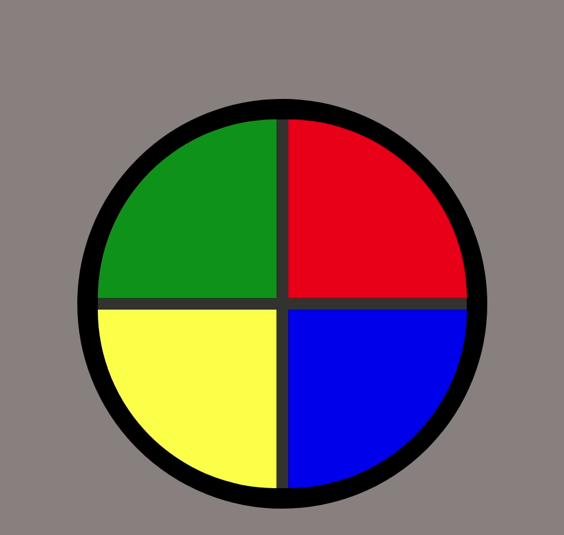

# Jogo estilo Genius 

Esse projeto teve como objetivo implementar um jogo no estilo Genius utilizando apenas HTML, CSS e Javascript de forma introdutória. Foram treinados os conceitos de CSS Grid, manipulação de Array e Arrow Functions.

## 👨‍💻️ Tecnologias Utilizadas
 

 
 
 
<h1 align="center">
  
</h1>